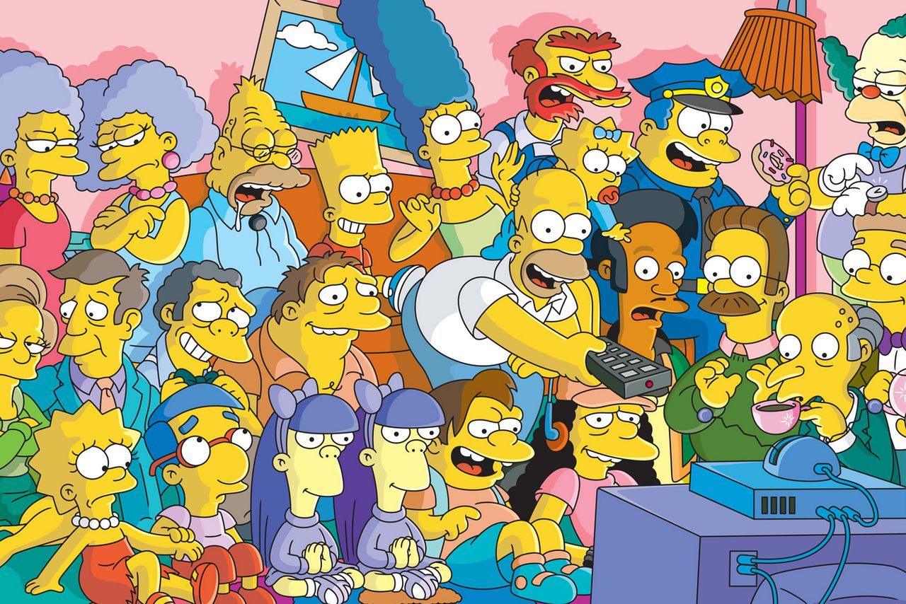
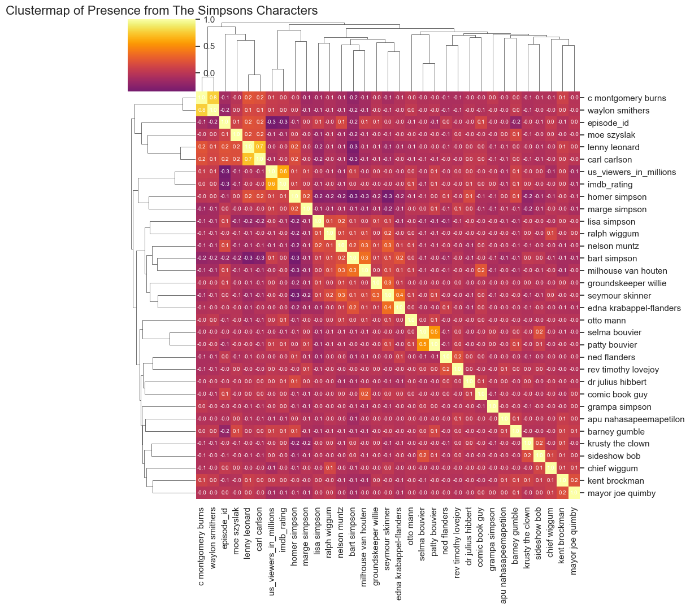
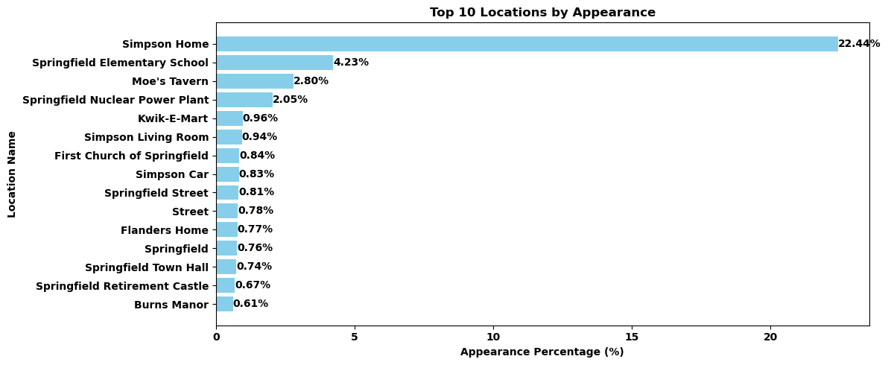
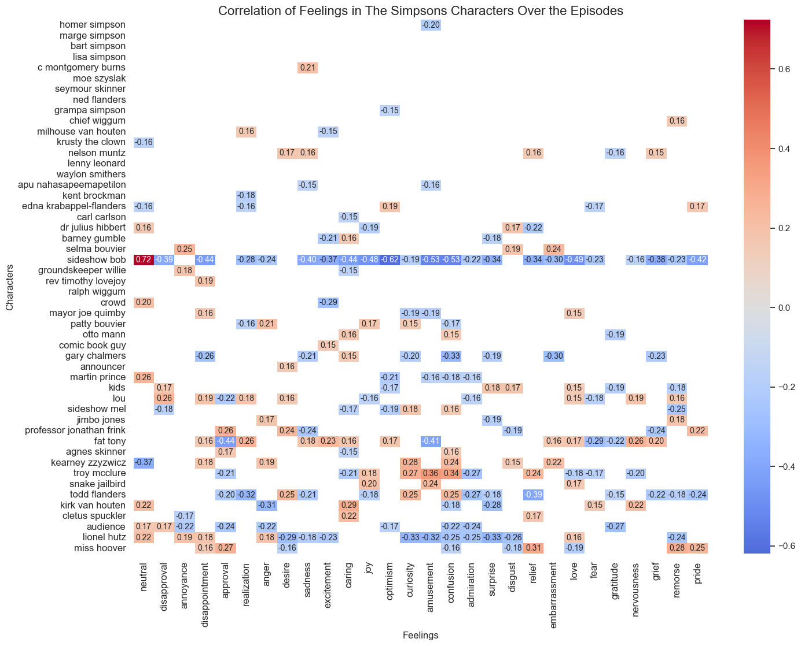
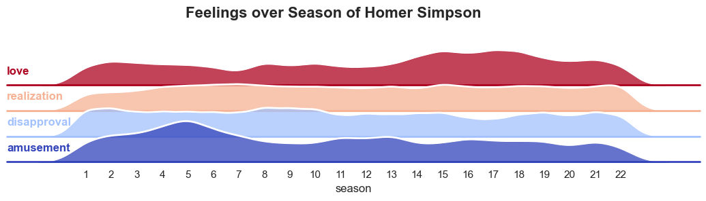
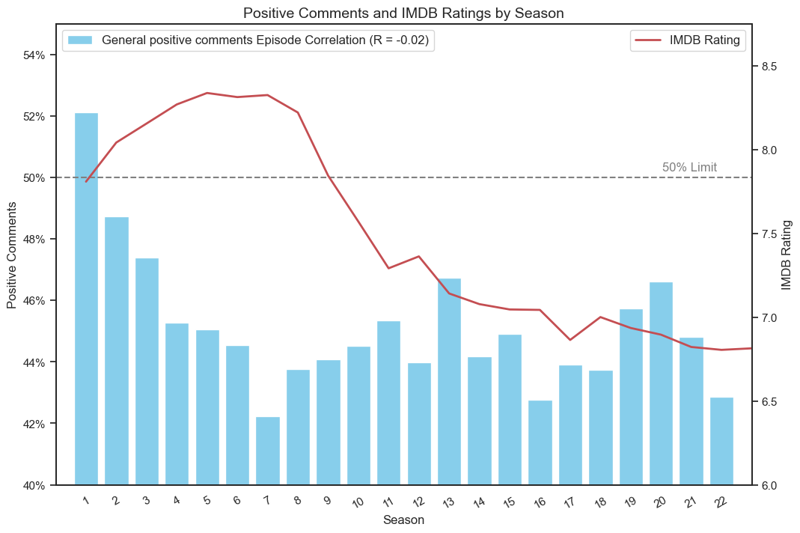

# Searching for Correlations in 'The Simpsons TV Show' 

### The goal is to identify quantitative variables that may be correlated with the quality of the show.

#### To evaluate the performance of each episode, we will analyze their IMDb scores and examine how episodes have evolved over time. We have all the required data in CSV files, which includes details about locations, characters, and the emotions expressed in each line of the TV show. Despite my belief that these variables may not strongly correlate with the quality of the show, let's proceed to explore the insights we can uncover!

#### Well, to start, it's not a big whoop that the show declined in quality over the seasons from an IMDb perspective. I mean, it has been on the air for over 30 years. We know that lots of things change.
#### So the idea is to look for unnoticed changes that are correlated with IMDb ratings over time, like:
- Does the appearance of certain characters make an episode better?
    #### Who doesn't have favorite characters and some others that we hate, but does it really make a difference in how good the episode is?
- Did the sentiments expressed by characters change over the episodes?
    #### Some of them really did, like Ned Flanders, but we are going to see if there's a change in sentiment in their lines.
- Are there certain locations that are less frequent than others in the show? 
    #### I'm not sure what we might find here. The arcade place?

#### Okay, let's get started.
## - Character lines 

#### So, we analyzed the Simpsons scripts from season 1 to season 22 and found that most of the lines are by far from Homer, more than double the rest of the family. Also, another surprising finding: most of the characters are males! Hmm, didn't see that coming.

### Clustermap of Appearances of Characters

#### Here we are going to check the relationship of appearances between each other over a clustermap. In other words, "How the appearance of one character is related to others."

#### I know, it looks like a lot!!

#### But let's focus on the interesting parts. It's pretty obvious that the best values are from the 'sidekick' pairs: Burns with Smithers 0.8, Bart and Milhouse 0.3, Patty and Selma 0.5, Lenny and Carl 0.7, and even Skinner and Edna 0.4.

#### But negative correlation? It looks like when Homer appears less, there's more space for Lisa, Bart, Nelson, or Skinner to show up (-0.2, -0.3)!

###  Correlation between characters and IMBD

#### In the top line, we see the characters that have the highest correlated values against IMDb Rating with a p-value > 0.10. The same thing with the bottom line, but with the lower values.

#### Even though the correlations 'r' and determination 'r^2' are really low, we could still find some relation for these characters. Homer, Otto, and Barney are not a big surprise, but Nelson and Moe? They are sometimes a pain in the ass.

#### Remember that correlation doesn't imply cause and effect. Just because a character appears more in the new episodes doesn't mean they are the cause of the "crappy" episodes. The opposite scenario occurs with Barney, which we will explore later.

### Character over seasons

#### Similarly to the previous graph, these are the characters that appear the most or the least over seasons with a p-value > 0.10.

#### I never thought that Barney and Smithers were left behind.

## Locations

#### These are the locations that appear most frequently in the show.

### Clustermap of Location Appearances

### Location Appearances Over Seasons

#### Not a big surprise that Barney's apartment was left out, knowing that the same thing happened to Barney.

#### Well, there is not much to see here, so we will keep going.

## Correlations in Emotions in Characters

#### For this part of the project, we analyzed all the lines from the Simpsons scripts that are in the .csv file [Script lines](cvs_files/script_lines.csv) and process it in [emotionas_analisis.ipynb](emotional_analisis.ipynb) thanks to hugging model: 
#### https://huggingface.co/SamLowe/roberta-base-go_emotions?library=true

    -The next graphs show the 'Neutral' emotion dropped for better perspective. 

### The Main Feelings That Appear in the Show

### Correlation of Emotions Over Episodes and IMDb Rating

#### Well, if you think about it, amusement and disapproval make a lot of sense; they're elemental for a fun episode. It's a shame that they were lost over the episodes. On the other hand, it looks like sadness, realization, and love are the emotions that were more present in the new and also in the "crappy" episodes. Now that I think about it, these are not the feelings I'm looking for in a funny episode. Even when there were great episodes that talk about love, it looks like the numbers don't say the same thing.

### Emotions Composition for the Main Characters

#### Here we have the composition of how much of every emotion analizes has every characters (the empty spaces are no significan values).  

### Correlation of Feelings in the Characters

#### The same thing as the graph from above; it only shows the most significant values (-0.15 <= values => 0.15).
#### Here we can see how much the characters change over time (episodes). The higher or redder the value, the stronger the feeling; while the lower or bluer it gets, the lower the feeling over episodes.

#### From what we can see, there are two main things. First, as the character has more appearances, the less significant are the values. Second, Sideshow Bob really changed over the episodes, which makes sense.

#### Okay, now we are going to see a list of characters that I found interesting to analyze.

### - Sideshow Bob
 

 
#### In the case of Sideshow Bob, it's not so much about the feelings gained over time, but the ones he lost. He started as a maniacal man trying to kill Bart and evolved into... well, whatever the series' plot needed.

### - Ned Flanders

 

#### In the case of Ned Flanders, it underwent something known as 'Flanderization.' Initially, he was a kind neighbor, and over time they started to exaggerate characteristics like becoming extremely naive or overly charitable or disapproving of several things. The big step was when his wife died in season 11; by that time, Neddy had already taken this path.

### Homer Simpson

 

#### Okay, in the case of Homer, I was expecting to find something that could explain how stupid and less funny he became over time. But the most interesting thing I found is how he started losing his amusement and started gaining... love? I don't know what to say about it.
#### how did this ballet  

#### change to this one?

### Montgomery Burn

 

#### Similar thing happened when we talk about 'Flanderization.' At first, he was the evil boss of Homer, but over time, we lost that characteristic, exaggerating the grief attitude, but furthermore, their sadness and starting to make jokes and laugh about how old and grief he is.

## Binomial Emotions

#### Here, we also analyzed all the lines from the Simpsons scripts that are in the .csv file [Script lines](cvs_files/script_lines.csv) and process it in [emotionas_analisis.ipynb](emotional_analisis.ipynb) thanks to hugging model: 
#### https://huggingface.co/distilbert/distilbert-base-uncased-finetuned-sst-2-english

#### What is different here is that the answers are binomial. In other words, it shows us the % of positive results, and from there we can say if it is a positive answer or not.

#### For the purpose of this work, we are only going to work with the numbers that give us.

### Positive Comments and IMDb Rating by Season

#### When we analyze the % of general comments, we can see how positive comments drop from the first season until seasons 5 to 8, just where they get the higher score on IMDb. Here is when they were more like the real Simpsons and less like the Waltons.

#### Unfortunately, the p-value of the IMDb correlation is higher than 0.05.

### Characters That Have Significant Correlation in Their Positive Comments Over Seasons.

#### Well, it's not unusual; Dr Hibber and Marge are the characters that are most worried and disapproving of others for not taking care of dangerous situations.
